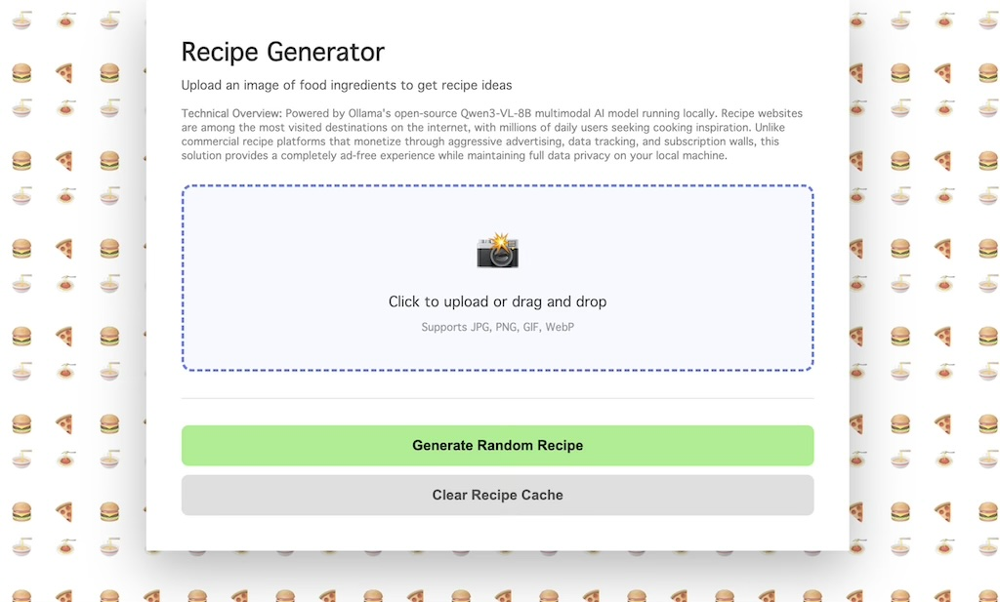
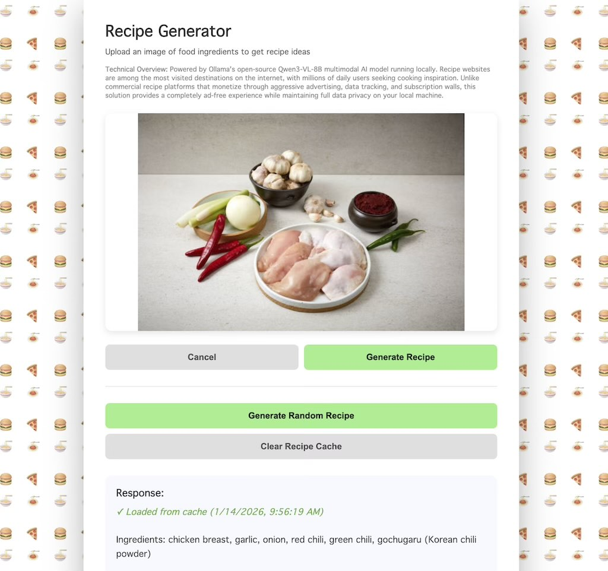

# Recipe Generator 🍕🍔🍝

An AI-powered recipe generator that uses computer vision to identify food ingredients from images and generate creative recipe suggestions. Built with Node.js, Fastify, and Ollama's open-source Qwen3-VL-8B multimodal AI model.





## Features

**Functionality**
- Upload images of food ingredients via drag-and-drop or file selection
- AI-powered ingredient identification using Qwen3-VL-8B vision model
- Automatic recipe suggestion generation based on detected ingredients
- Detailed step-by-step recipe retrieval with ingredients and instructions

**Features**
- **Local Processing**: All AI processing happens locally on your machine - complete privacy
- **Recipe Caching**: Intelligently caches processed images and their recipes for instant retrieval
- **No Advertisements**: Unlike commercial recipe websites, enjoy an ad-free experience

## Tech Stack

- **Frontend**: Vanilla JavaScript, HTML5, CSS3
- **Backend**: Node.js, Fastify
- **AI Model**: Ollama Qwen3-VL-8B (Vision-language model)
- **Monitoring**: Prometheus metrics via prom-client
- **API Proxy**: Local proxy to Ollama API

## Prerequisites

Before running this application, you need to install:

1. **Node.js** (v14 or higher)
2. **Ollama** - Open-source LLM runner
3. **Qwen3-VL-8B Model** - Vision-language model for image understanding

## Installation Guide

### Step 1: Install Ollama

Ollama is an open-source tool that runs large language models locally.

**macOS / Linux:**
```bash
curl -fsSL https://ollama.com/install.sh | sh
```

**Windows:**
Download the installer from [ollama.com](https://ollama.com)

**Verify Installation:**
```bash
ollama --version
```

### Step 2: Pull the Qwen3-VL-8B Model

Qwen3-VL-8B is an 8-billion parameter multimodal model that can understand both images and text.

```bash
ollama pull qwen/qwen3-vl-8b
```

**Verify Model Installation:**
```bash
ollama list
```

You should see `qwen/qwen3-vl-8b` in the list of installed models.

### Step 3: Install Project Dependencies

Navigate to the project directory and install Node.js dependencies:

```bash
cd recipe-generator
npm install
```

This will install:
- `fastify` - High-performance web server framework
- `@fastify/cors` - Cross-origin resource sharing
- `@fastify/static` - Static file serving
- `node-fetch` - HTTP client for API requests
- `winston` - Logging library
- `prom-client` - Prometheus metrics collection

## Running the Application

### Start Ollama Server

Ollama runs as a background service. Start it with:

```bash
ollama serve
```

The Ollama API will be available at `http://127.0.0.1:1234`

### Start the Recipe Generator Server

In a new terminal, start the Node.js server:

```bash
node server.js
```

You should see:
```
Recipe Generator server running at http://localhost:3000
Metrics available at http://localhost:3000/metrics
Proxying API requests to http://127.0.0.1:1234
Press Ctrl+C to stop the server
```

### Access the Application

Open your browser and navigate to:
```
http://localhost:3000
```

## Usage

### 1. Upload an Image

- **Method 1**: Click the upload area and select an image file
- **Method 2**: Drag and drop an image onto the upload area

Supported formats: JPG, PNG, GIF, WebP

### 2. Generate Recipes

Click the **"Generate Recipe"** button to:
1. Analyze the image for ingredients
2. Receive a list of possible recipes
3. View the AI's response in the response box

### 3. Select a Recipe

If the AI identifies multiple recipe options:
1. Use the dropdown menu to select a recipe
2. Click **"Get Complete Recipe"** for detailed instructions
3. View ingredients, quantities, and step-by-step cooking directions

### 4. Test API Connection

Use the **"Generate Random Recipe (Test API)"** button to:
- Verify your Ollama installation is working
- Test the API connection without uploading an image
- Generate a random recipe suggestion

## Caching Feature

The application automatically caches processed images and their recipes:

- **Automatic Caching**: When you generate recipes from an image, the results are saved locally
- **Instant Retrieval**: Upload the same image again to instantly see cached results
- **Cache Indicator**: Cached results display with a green checkmark and timestamp
- **Storage Management**: Automatically manages up to 20 cached recipes
- **Manual Clear**: Use the "Clear Recipe Cache" button to remove all cached data

## API Proxy Configuration

The application runs a proxy server at `/api/chat/completions` that forwards requests to the Ollama API. This enables:

- CORS handling for browser requests
- Request logging and monitoring
- Prometheus metrics collection

### Prometheus Metrics

Access metrics at `http://localhost:3000/metrics`:
- `http_requests_total` - Total HTTP requests by endpoint
- `http_request_duration_seconds` - Request duration histogram
- `api_proxy_requests_total` - API proxy request count
- `api_proxy_errors_total` - API proxy error count
- Default Node.js metrics (CPU, memory, event loop)

## Project Structure

```
recipe-generator/
├── server.js           # Fastify server with API proxy and metrics
├── index.html          # Frontend application
├── package.json        # Node.js dependencies
├── README.md          # This file
└── screenshot.png     # Application screenshot
```

## Customization

### Modify AI Model

Edit the `model` parameter in `index.html` to use different Ollama models:

```javascript
const payload = {
    model: "qwen/qwen3-vl-8b",  // Change this
    messages: [...]
};
```

### Adjust Cache Size

Modify the `MAX_CACHE_SIZE` constant in `index.html`:

```javascript
const MAX_CACHE_SIZE = 20; // Change this value
```

### Change UI Colors

Update the CSS variables in `index.html`:
- Button colors: `.btn-primary` class
- Background opacity: `body::before` opacity value
- Scrollbar colors: `::-webkit-scrollbar-thumb` styles

## Troubleshooting

### Ollama Connection Issues

**Problem**: "Failed to connect to API server"

**Solutions**:
1. Ensure Ollama is running: `ollama serve`
2. Check Ollama is accessible: `curl http://127.0.0.1:1234/api/tags`
3. Verify the model is installed: `ollama list`
4. Check server.js API_URL matches your Ollama endpoint

### Model Not Found

**Problem**: "Model not found" error

**Solution**:
```bash
ollama pull qwen/qwen3-vl-8b
```

### Port Already in Use

**Problem**: "Port 3000 is already in use"

**Solution**: Change the port in `server.js`:
```javascript
const PORT = 3001; // Use different port
```

### Image Upload Issues

**Problem**: "Invalid file format" error

**Solution**: Ensure your image is JPG, PNG, GIF, or WebP format

## Performance Tips

1. **Use Caching**: The app automatically caches recipes - upload the same image for instant results
2. **Optimize Images**: Smaller images process faster (recommended: < 2MB)
3. **Local Processing**: Everything runs locally - no internet required after initial setup
4. **Monitor Resources**: Check Prometheus metrics to track performance


## Future Enhancements

Potential features for future versions:
- [ ] Recipe rating and saving system
- [ ] Shopping list generation
- [ ] Nutritional information calculation
- [ ] Recipe search and filtering
- [ ] Multiple language support
- [ ] Export recipes to PDF
- [ ] Recipe printing optimization

## Contributing

Contributions are welcome! Feel free to:
- Report bugs
- Suggest new features
- Submit pull requests
- Improve documentation

## License
This project is open-source and available under the MIT License.

